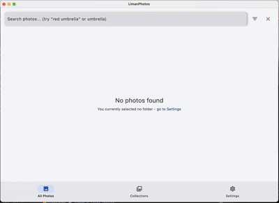

# LimanPhotos

An offline desktop photo organizer that uses **Ollama & LLaVA** to intelligently organize your photos into collections.
Inspired by Google Photos, and available for Mac, Windows, and Linux(Ubuntu). 
This is a spin-off (pivot?) of my other project, [LimanDoc](https://limandoc.com/).



## Features

-  **AI-Powered Organization** - Automatically analyze and tag photos using local LLaVA models
-  **Smart Collections** - Group photos by content, objects, scenes, and themes
-  **Advanced Search** - Find photos by file name and tags that AI detected - also use double quotes to search by phrases. 
Search is powered by Apache Lucene.
Basic filtering by file size and type is also available.
-  **Privacy-First** - Everything runs locally, no cloud services required
- ️ **Mac/Windows/Linux** - Built with Kotlin Multiplatform. Mobile support coming soon!

## Features I want to add
- **Improve performance** - Optimize photo loading and analysis speed
- **Face Recognition** - Identify people in your photos
- **Geotagging** - Organize photos by location
- **Video Support** - Analyze and organize videos alongside photos
- **Local Sync** - Optional cloud backup for your collections

## Prerequisites

- **Java 17+** for running the application
- **Ollama** for AI image analysis ([installation guide](https://ollama.com/download))
- **Good CPU & RAM** I tested this on Mac(48GB RAM M4 Pro), and Windows(Intel i7-8700, 32GB RAM), and Linux on VM
- **LLaVA model** (`ollama pull llava`)

## Installation & Running

1. **Install Ollama and LLaVA**:
   ```bash
   # Install Ollama (see https://ollama.com/download for your platform)
   ollama serve
   ollama pull llava
   ```

2. **Clone and run**:
   ```bash
   git clone <repository-url>
   cd LimanPhotos
   ./gradlew :composeApp:run
   ```
   
3. **Alternatively, download the latest release from github.**
Note for Mac users: DMG is unsigned, so you will need to
- Open LimanPhotos 1-2 times. 
- Go to Settings -> Privacy & Security -> scroll down and click "Open Anyway"

4. **First-time setup**:
   - Open Settings to select photo folders. It might take a while to display photos if you have large directories.
   - Start AI analysis to build your collections. This can take a while depending on the number of photos and your hardware.
   - Browse and search your organized photos. 
   - Go to Collections to see AI-generated groups based on content.

## Building yourself

### Project Structure

- `composeApp/` - Main application code (Kotlin Multiplatform)
- `composeApp/src/commonMain/` - Shared UI and business logic
- `composeApp/src/jvmMain/` - Desktop-specific implementations
- `OLLAMA_SETUP.md` - Detailed AI setup instructions

## Contributing

1. Fork the repository
2. Create a feature branch
3. Make your changes
4. Test with `./gradlew test`
5. Submit a pull request
6. The code itself was written 80% by Claude in a couple of days. Don't forget 80-20 rule though.

## License

Apache 2.0

---
